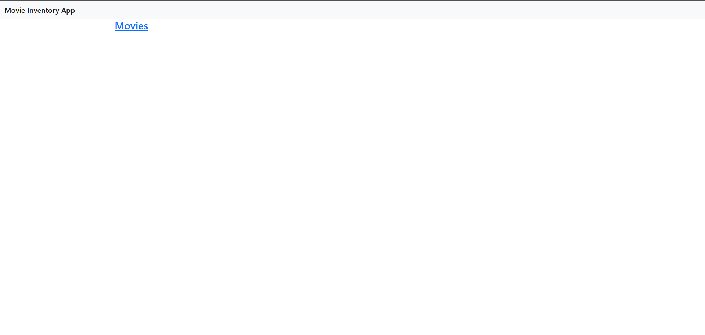
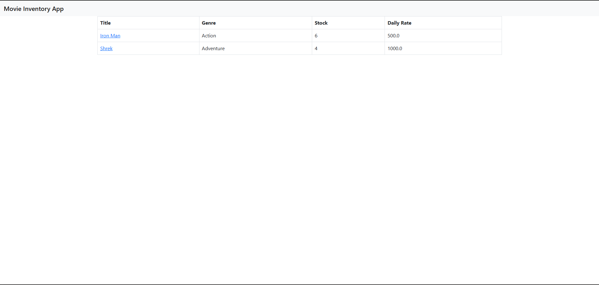
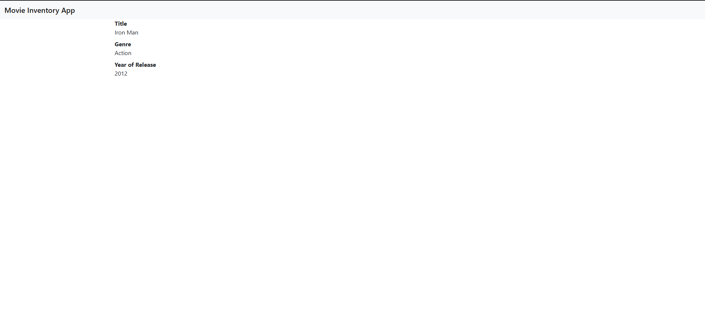
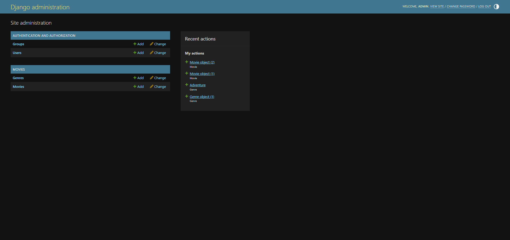
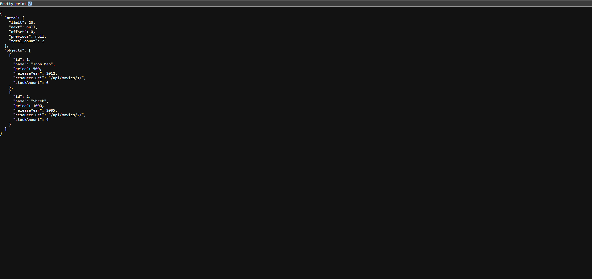

# Movie Inventory App

A full-stack web application for managing a movie inventory, built with **Django** on the backend and a dynamic **JavaScript/CSS** frontend. The app exposes a REST API powered by **django-tastypie**.

🔗 **Live Demo:** [https://movie-app-rxre.onrender.com/](https://movie-app-rxre.onrender.com/)

---

## Features

- Browse and manage a collection of movies
- RESTful API for movie data via django-tastypie
- Admin panel for content management (via Django Admin + Netlify CMS config)
- Static file serving with WhiteNoise (no external CDN required)
- Production-ready with Gunicorn, deployed on **Render**

---

## Tech Stack

| Layer      | Technology                        |
|------------|-----------------------------------|
| Backend    | Python, Django 6                  |
| API        | django-tastypie                   |
| Frontend   | JavaScript, CSS, HTML             |
| Database   | SQLite (development)              |
| Server     | Gunicorn + WhiteNoise             |
| Deployment | Render                            |

---

## Project Structure

```
movie-app/
├── MovieApp/          # Django project settings & URLs
├── api/               # Tastypie API resources
├── movies/            # Movies app (models, views, etc.)
├── templates/         # HTML templates
├── static/admin/      # Static files & CMS config
├── manage.py
├── requirements.txt
├── Procfile           # For Render deployment
└── db.sqlite3         # Development database
```

---

## Getting Started

### Prerequisites

- Python 3.10+
- pip

### Installation

1. **Clone the repository**
   ```bash
   git clone https://github.com/alinoor4/movie-app.git
   cd movie-app
   ```

2. **Create and activate a virtual environment**
   ```bash
   python -m venv venv
   source venv/bin/activate      # On Windows: venv\Scripts\activate
   ```

3. **Install dependencies**
   ```bash
   pip install -r requirements.txt
   ```

4. **Apply migrations**
   ```bash
   python manage.py migrate
   ```

5. **Create a superuser** (for the admin panel)
   ```bash
   python manage.py createsuperuser
   ```

6. **Run the development server**
   ```bash
   python manage.py runserver
   ```

   Visit `http://127.0.0.1:8000` in your browser.

---

## API

The app exposes a REST API using django-tastypie. Endpoints are available under `/api/` and return JSON.

Example:
```
GET /api/v1/movie/
GET /api/v1/movie/{id}/
```

---

## Deployment

The app is live on **Render**: [https://movie-app-rxre.onrender.com/](https://movie-app-rxre.onrender.com/)

It is deployed using Gunicorn as the application server:

```
web: gunicorn MovieApp.wsgi
```

Static files are served via **WhiteNoise**, so no separate static file hosting is needed.

### Steps to Deploy on Render

1. Push your repository to GitHub.
2. Go to [Render Dashboard](https://dashboard.render.com) → **New > Web Service**.
3. Connect your GitHub repository and configure:

   | Setting           | Value                             |
   |-------------------|-----------------------------------|
   | **Environment**   | Python                            |
   | **Build Command** | `pip install -r requirements.txt` |
   | **Start Command** | `gunicorn MovieApp.wsgi`          |

5. Click **Deploy** — Render will build and serve the app automatically.

---

## Screenshots

| Home | Movie List |
|---|---|
|  |  |
| Movie Detail | Admin Panel |
|---|---|
|  |  |
| API Response |
|---|
|  |

---

## License

This project is licensed under the [GPL-3.0 License](LICENSE).
